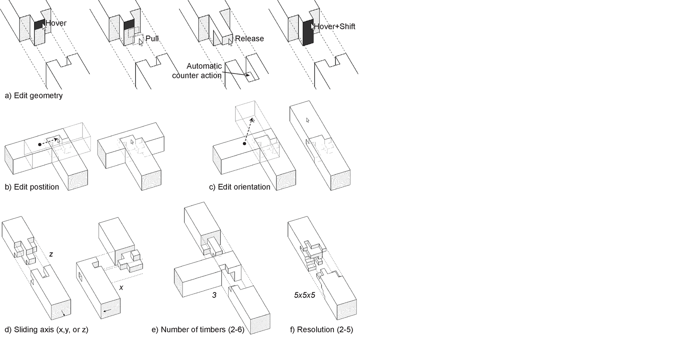
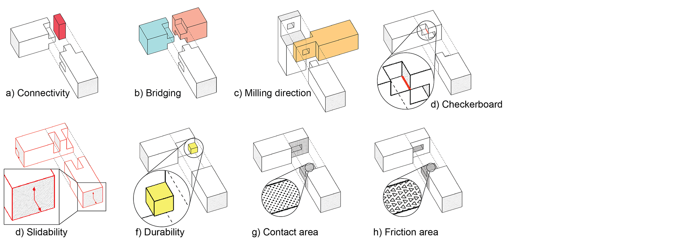

# Tsugite

NOTE: Original project is here `marialarsson/tsugite`. I just creating a new copy cause I intend to change and study this but not really contribute cause I'm still a beginner. Project is good example of learning **computer graphics, computational geometry, OpenGL and numpy.**

## Interactive Design and Fabrication of Wood Joints


This is the repository related to a paper presented at UIST 2020.
It is an interface where you can model a joint geometry in a voxelized design space, and export milling paths for fabrication with a 3-axis CNC-machine.

This software is free for personal use and non-commercial research conducted within non-commercial organizations.
If you want to use it for commercial purposes, please contact Kaoru Shigeta (shigeta@todaitlo.jp).

### Environment
- Python 3.8.3
- pip 21.1.2
- Packages: [requirements.txt](requirements.txt)

It is recommended to use a virtual environment, for example [venv](https://docs.python.org/3/library/venv.html).

The following command will install the packages at once.
```
$ pip install -r requirements.txt
```

### Run Program
After installing the necessary packages, run the application by the following commands.
```
$ cd setup
$ python tsugite_app.py
```

### Interface
Open a joint by double-clicking anywhere or by pressing the SPACE bar.
Edit the joint geometry by pushing and pulling on the faces. Change the orientation and position of the wood components by dragging them. Other properties can be edited in the control panel to the left. Editable properties are summarized in the figure below.



The system performs geometric evaluations in real time and provides graphical feedback accordingly (see a-h below).



In case of an invalid joint, the system also gives suggestions (on the right side). The suggestions consists of up to four valid joint geometries within one edit distance from the current design.

For more details, see the [User Interface Wiki](https://github.com/marialarsson/tsugite/wiki/User-Interface-Manual) (coming soon).

### File format *.tsu
*.tsu is a is_unique file format for this application.
This file [my_joint.tsu](my_joint.tsu) is provided as an example.
You can save and open *.tsu files from the menu bar in the interface.

### Fabrication
Set machine origin at the center of the top side of the joint.
Insert wood bar a) vertically if the sliding/fabrication is aligned with the timber axis, and b) horizontally if it is perpendicular to the timber axis.


For more details, see the [Fabrication Wiki](https://github.com/marialarsson/tsugite/wiki/Fabrication-Manual) (coming soon).

### Disclaimer
Please note that this is a research prototype and not a consumer-ready product.
We cannot provide technical support and we are not responsible for any damage to your fabrication equipment.

### Publication
Maria Larsson, Hironori Yoshida, Nobuyuki Umetani, and Takeo Igarashi. 2020. Tsugite: Interactive Design and Fabrication of Wood Joints. In Proceedings of the 32nd Annual ACM Symposium on User Interface Software and Technology (UIST '20). Association for Computing Machinery, Virtual Event, USA.

ACM link: https://dl.acm.org/doi/abs/10.1145/3379337.3415899

Project page: http://www.ma-la.com/tsugite.html

Paper PDF: http://ma-la.com/Tsugite_UIST20.pdf
